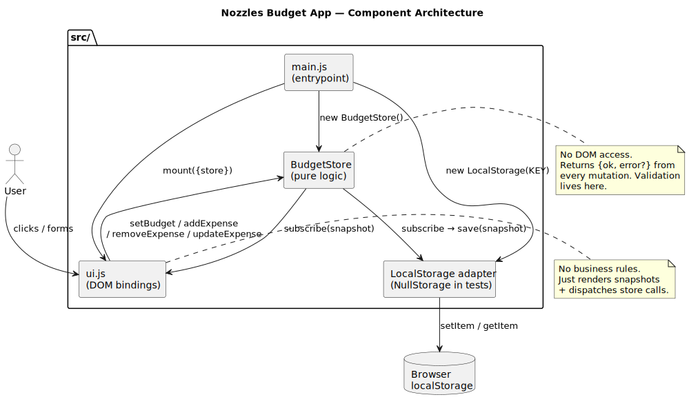
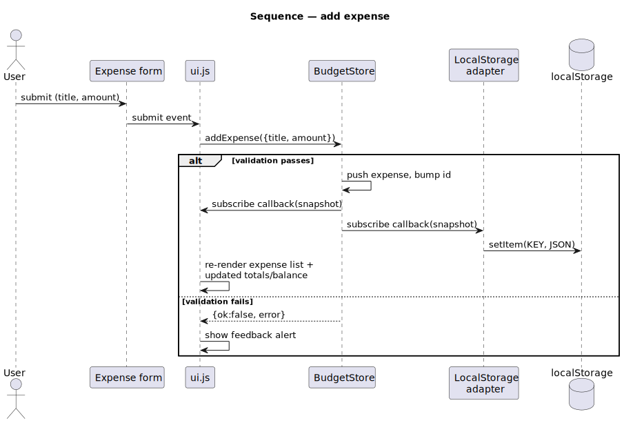
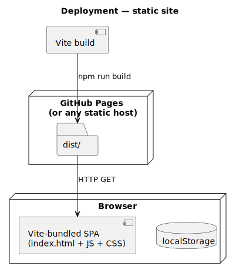

# Nozzles Budget App

A tiny single-page budget tracker — set a budget, log expenses, watch the
balance go red.

[](https://github.com/tzone85/smallBudgetApp/actions/workflows/ci.yml)


Originally a single `js/app.js` with a `UI` class that mixed business logic,
DOM access, and event handlers — plus two real bugs (`return ... ; this.showBalance()`
in `editExpense` and `deleteExpense` meant the balance never updated after either
action). Rewritten with a pure `BudgetStore`, a swappable storage adapter,
Vite bundling, Vitest, Playwright e2e, and CI.

## Highlights

- **Pure logic separated from the DOM** — `BudgetStore` returns `{ok, error?}`
  from every mutation, fires a snapshot to subscribers, and never touches HTML.
- **Pluggable persistence** — `LocalStorage` adapter in production,
  `NullStorage` in tests/SSR. State auto-saves on every change.
- **XSS-safe rendering** — all user content goes through DOM `textContent`
  rather than `innerHTML` (regression test exercises an `` payload).
- **97% line coverage** on the pure modules, 6 Playwright flows exercising
  the real UI in Chromium.
- **Vite + ESM + Bootstrap 5** (replaces jQuery + Bootstrap 4 bundle).
- **CI**: lint → unit (with coverage gate 85%) → Playwright e2e → Vite build,
  with `dist/` and `playwright-report/` uploaded as artifacts.

## Architecture

### Components



### Add-expense flow



### Deployment



Diagrams are PlantUML sources under `docs/architecture/*.puml`; rendered SVGs
are checked in. Regenerate with `./scripts/render_diagrams.sh` (requires
`plantuml` — `brew install plantuml`).

## Quick start

```bash
npm install
npm run dev          # vite dev server on :5173
npm run build        # produces dist/
npm run preview      # serve dist/ on :4173
npm test             # vitest + coverage
npm run test:e2e     # playwright against the preview server
npm run lint         # eslint
```

## Project layout

```
src/
├── main.js          # entrypoint — wires store, storage, ui
├── budget-store.js  # pure BudgetStore (no DOM, no I/O)
├── storage.js       # LocalStorage + NullStorage adapters
├── ui.js            # thin DOM-binding layer
└── styles/main.css
tests/
├── unit/            # vitest, happy-dom env
└── e2e/             # playwright + chromium
docs/architecture/   # PlantUML sources + rendered SVGs
.github/workflows/ci.yml
```

## API of the store

```js
const store = new BudgetStore();
store.setBudget(1000);                            // {ok:true}
store.addExpense({title: "rent", amount: 400});   // {ok:true, expense:{...}}
store.updateExpense(id, {amount: 500});           // {ok:true, expense:{...}}
store.removeExpense(id);                          // {ok:true}
store.subscribe((snap) => console.log(snap));     // returns unsubscribe fn
store.hydrate({budget, expenses});                // restore from storage
store.snapshot();                                 // {budget, expenses, totalExpenses, balance, balanceState}
```

`balanceState` is `"positive" | "negative" | "zero"` — used by the UI to swap
the CSS class on the balance display.

## License

MIT — see [LICENSE](LICENSE).
