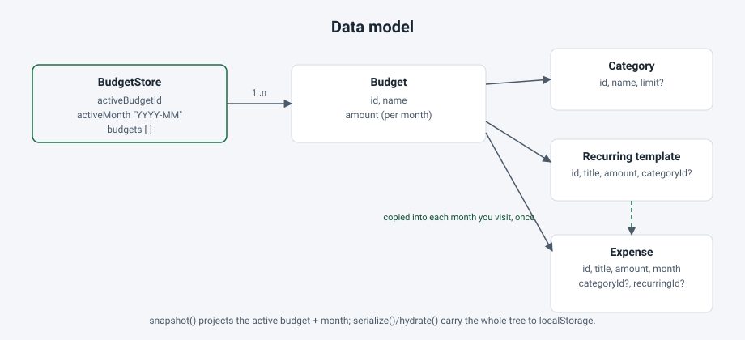

# Nozzles Budget App

A budget tracker that runs entirely in your browser. Several named budgets,
monthly periods, categories with spending limits, recurring expenses, an SVG
spending summary, CSV export, and a dark mode. Amounts in ZAR; data stays in
localStorage.

[](https://github.com/tzone85/smallBudgetApp/actions/workflows/ci.yml)


## Features

- **Named budgets** — create, switch, delete. Each keeps its own amount,
  categories, and expenses.
- **Monthly periods** — expenses live in a `YYYY-MM` month; the month picker
  moves you around, totals follow.
- **Categories with limits** — optional monthly limit per category; blow it
  and the category (and its summary bar) turns red.
- **Recurring expenses** — tick "repeats every month" and the expense copies
  itself into every month you visit, until you stop it.
- **Summary** — a bar chart per category, drawn as a plain SVG string by
  `src/summary-svg.js`. No chart library.
- **CSV export** — one click downloads every expense in the active budget.
  Quoted per RFC 4180, formula-injection safe.
- **Dark mode** — one toggle, persisted, done entirely by swapping the design
  tokens on `[data-theme="dark"]`.

## Architecture




Both diagrams are hand-authored SVGs — edit the files directly; there is no
generator. Decisions live in `docs/adr/`.

The rule of the codebase: `BudgetStore` is pure. No DOM, no I/O, not even
`Date` — the entry point passes the current month in. The UI renders
snapshots and dispatches events; a storage adapter persists `serialize()`
output and feeds it back through `hydrate()`, which also migrates the old
v1 single-budget shape.

## Quick start

```bash
npm install
npm run dev          # vite dev server on :5173
npm run build        # produces dist/
npm run preview      # serve dist/ on :4173
npm test             # vitest + coverage (85% gate)
npm run test:e2e     # playwright against the preview server
npm run lint         # eslint
```

## Project layout

```
src/
├── main.js          # entrypoint — wires store, storage, theme, ui
├── budget-store.js  # pure BudgetStore (no DOM, no I/O, no Date)
├── csv.js           # CSV writer
├── summary-svg.js   # summary chart as an SVG string
├── theme.js         # light/dark switch, persisted
├── storage.js       # LocalStorage + NullStorage adapters
├── ui.js            # thin DOM-binding layer
└── styles/          # tokens.css (light + dark), base.css, main.css
tests/
├── unit/            # vitest, happy-dom env
└── e2e/             # playwright + chromium
docs/
├── architecture.svg # hand-authored overview
├── data-model.svg   # hand-authored data model
└── adr/             # architecture decision records
```

## API of the store

```js
const store = new BudgetStore({ month: "2026-07" });

// budgets
store.createBudget("Side hustle");        // {ok, budget:{id,name}} — auto-selects
store.renameBudget(id, "Household");      // {ok}
store.deleteBudget(id);                   // {ok} — refuses to delete the last one
store.selectBudget(id);                   // {ok}

// months + amount
store.setMonth("2026-08");                // {ok} — materialises recurring expenses
store.setBudget(1000);                    // {ok} — amount for the active budget

// categories
store.addCategory({name: "Food", limit: 300});  // {ok, category} — limit optional
store.updateCategory(id, {limit: null});        // {ok, category} — null clears
store.removeCategory(id);                       // {ok} — expenses become uncategorised

// expenses
store.addExpense({title, amount, categoryId});  // {ok, expense} — active month
store.updateExpense(id, {amount: 500});         // {ok, expense}
store.removeExpense(id);                        // {ok}

// recurring
store.addRecurring({title: "Rent", amount: 400});  // {ok, recurring}
store.removeRecurring(id);                          // {ok} — past instances stay

// everything else
store.exportCsv();          // "month,title,category,amount,recurring\r\n..."
store.snapshot();           // projection of the active budget + month
store.serialize();          // full state for persistence
store.hydrate(data);        // restore; migrates the legacy v1 shape
store.subscribe(fn);        // fn(snapshot) after every change; returns unsubscribe
```

Every mutation returns `{ok: true, ...}` or `{ok: false, error}` — nothing
throws. `snapshot()` gives `{budgets, activeBudgetId, activeMonth, budget,
categories, recurring, expenses, totalExpenses, balance, balanceState}`,
where each category carries `spent` and `over` for the active month and
`balanceState` is `"positive" | "negative" | "zero"`.

## License

MIT — see [LICENSE](LICENSE).
